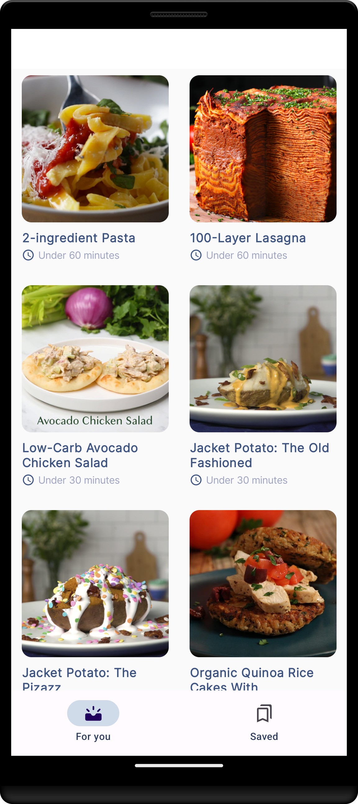
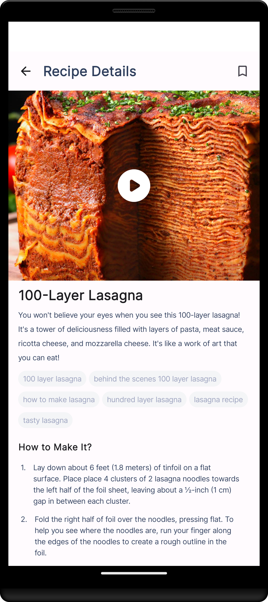

# Android application for showing Tasty recipes

    

    Tasty App is a fully functional Android app built entirely with Kotlin and Jetpack Compose. This repository serves as an Android project architecture showcase. It follows Android design and development best practices and is intended to be a useful reference for developers.

    
    
    

    

Repository was initially based on the official [Now in Android App](https://github.com/android/nowinandroid) and it is
updated to use latest tech stack in Android ecosystem. This project uses free [Tasty API](https://rapidapi.com/apidojo/api/tasty) for fetching the data.

## Features
App starts with [Onboarding screen](app/src/main/kotlin/com/example/tasty/ui/screen/onboarding/OnboardingScreen.kt), which can be further improved to better explain to a new user all possiblities within the app. Once user finishes with the Onboarding process, he lands on the [screen which shows all currently available recipes](app/src/main/kotlin/com/example/tasty/ui/screen/foryou/ForYouScreen.kt). Recipes are presented with the thumbnail, title and approximate cooking time. User can further explore the recipe by clicking on the [recipe card](app/src/main/kotlin/com/example/tasty/ui/recipe/RecipeCard.kt), which triggers navigation to the [recipe details screen](app/src/main/kotlin/com/example/tasty/ui/screen/recipe/RecipeScreen.kt). On this screen, user can see video tutorial, title, description, recipe keywords and detailed step by step instructions. Additionally, user can bookmark the recipe, to find it easier later on the [Bookmarks screen](app/src/main/kotlin/com/example/tasty/ui/screen/bookmark/BookmarksScreen.kt).

### Libraries

* [Jetpack Core][core]
* [MVVM architectural pattern][mvvm]
* [Dependency injection with Hilt][hilt]
* [Jetpack Compose UI][compose]
* [Room][room] to save data in a local database
* [Material Design 3][material3]
* [Downloadable Fonts][fonts]
* [Retrofit][retrofit] for REST API communication
* [Moshi][moshi] for parsing JSON into Kotlin classes
* [Coil][coil] for image loading
* [Media3 ExoPlayer][exoplayer] for playing video tutorials

[core]: https://developer.android.com/jetpack/androidx/releases/core

[mvvm]: https://developer.android.com/topic/libraries/architecture/viewmodel

[hilt]: https://developer.android.com/training/dependency-injection/hilt-android

[compose]: https://developer.android.com/jetpack/compose

[material3]: https://m3.material.io/develop/android/mdc-android

[fonts]: https://developer.android.com/develop/ui/views/text-and-emoji/downloadable-fonts

[retrofit]: http://square.github.io/retrofit

[moshi]: https://github.com/square/moshi

[coil]: https://coil-kt.github.io/coil/compose

[room]: https://developer.android.com/jetpack/androidx/releases/room

[exoplayer]: https://developer.android.com/media/media3/exoplayer
